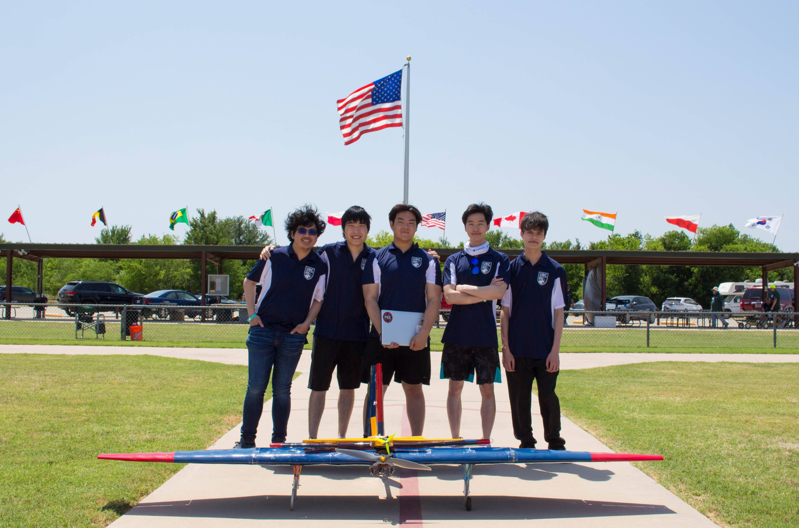
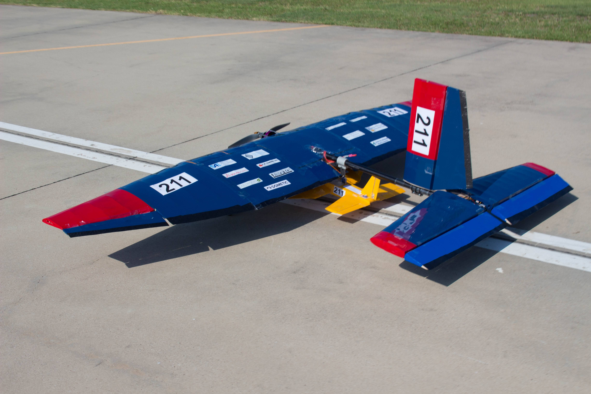
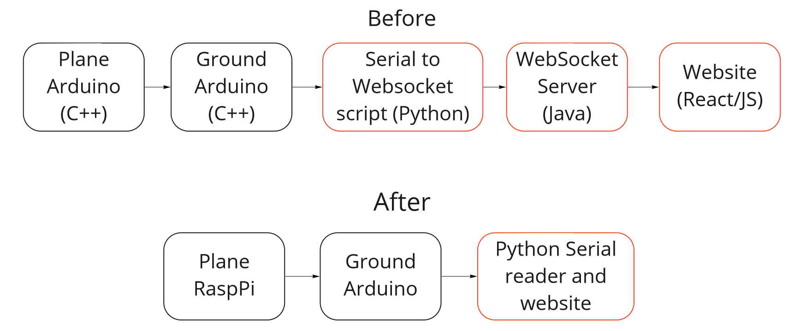
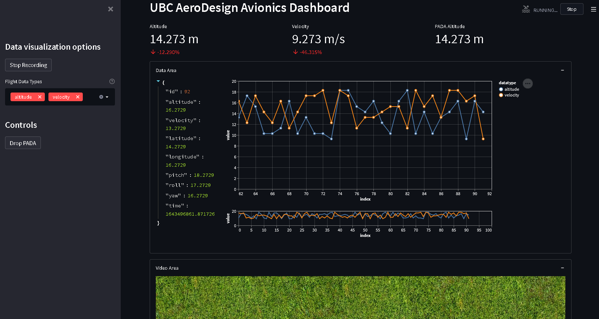
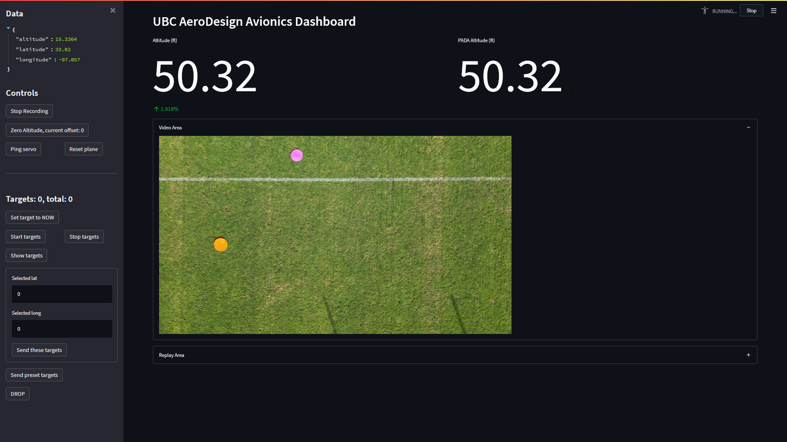
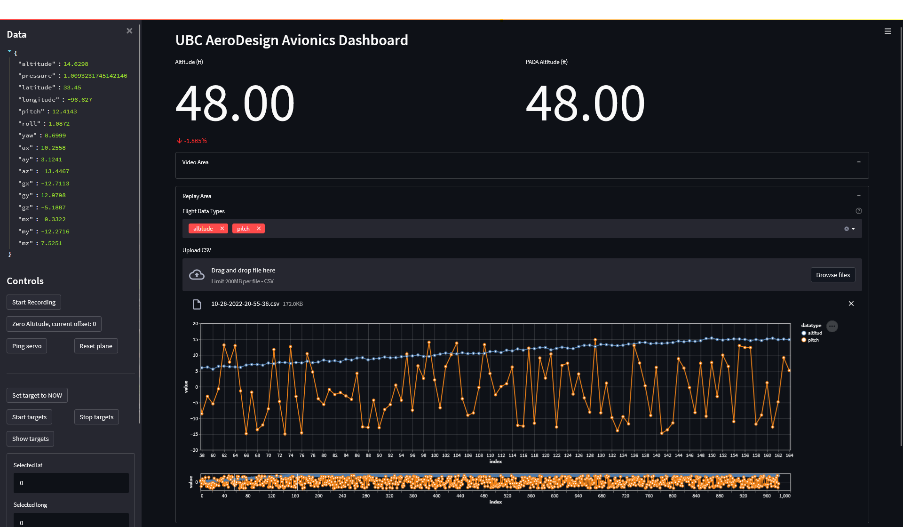
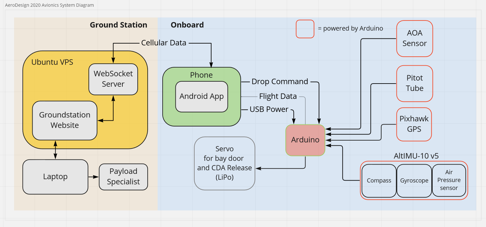
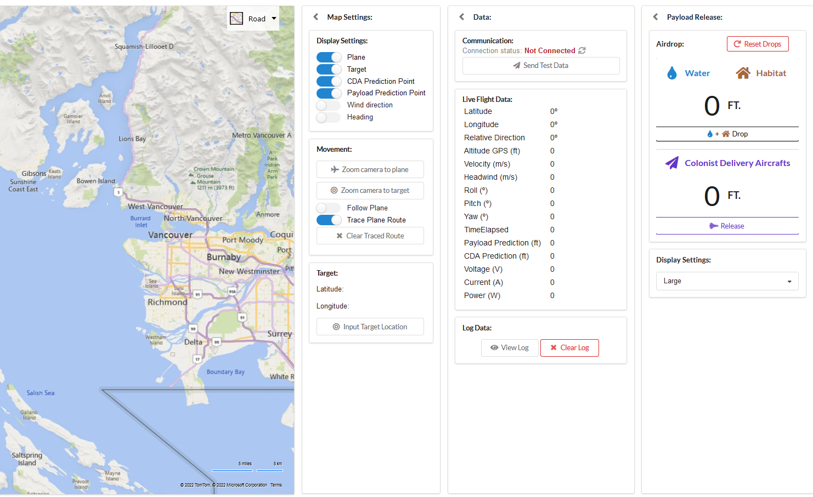
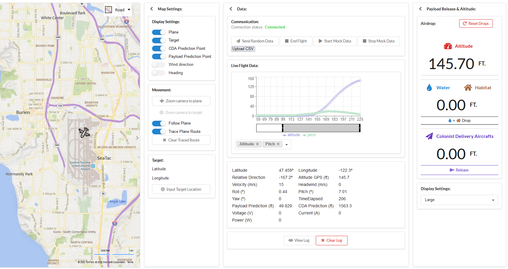
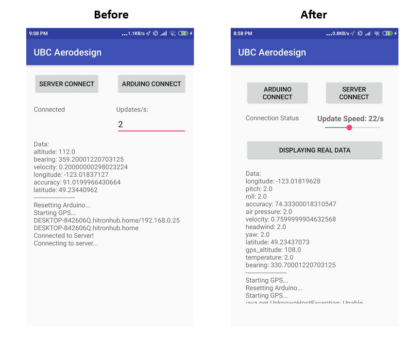

## Summary
**UBC AeroDesign** (UBCAD) is the University of British Columbia's airplane design team with over 50+ members. I've been on the team since
2020, and I'm currently the **software lead**. My time on this team has been very rewarding: it has been both a source
of a lot of my growth as an engineer *and* the perfect place for me to apply and share my expertise. Read on to see the
problems I solved.

## Competition
The SAE AeroDesign competition during my time with the team was complex and intriguing.

Teams had to build a large
primary aircraft whose main goal was to deliver water to simulate a wildfire fight. The primary aircraft
also carries a smaller aircraft called the PADA (Powered Autonomous Delivery Aircraft). You can see our 2022 planes
in this picture I took:

The field that the aircrafts fly over has colored discs laid on the ground. Without prior knowledge of the location of
these discs, teams have to deploy the PADA midair to land within a 15 ft radius of them. The competition also had an
autonomous ground terrain vehicle portion too, but our team decided to focus on the PA and PADA as a scoring strategy.

While I've been on the team, our team has only been able to physically go to competition once, in 2022, due to the
COVID-19 pandemic. Unfortunately, UPS lost most of our Regular Class plane and some of our Advanced Class plane,
so we only managed to eke out one flight round outside of the competition. Our sights are set on the 2023 competition,
and I am confident that we're going to be highly competitive with the progress our team has made, including in the
software department.

## 2022 Work

Our team is going to compete in the 2023 competition, as such, I won't share too much until afterwards! For now, here's some work I did that will probably not be critical to our strategy.

### Optical flow
During the preliminary design phase every year, the team tries out novel projects for a short period of time to encourage innovation and to suss out good ideas we might want to incorporate into the detailed design. One idea we had for the software was to determine the ground speed using optical flow algorithms,
and so I spent a day figuring out how to use it, making this prototype:



## 2021 Work
### Python Dashboard
The majority of my time in 2021 was spent building a new live avionics dashboard application in Python.

This was part of a greater effort to move from the legacy architecture to a new one:

Our reasoning for the transition was simply that Python is much easier to understand than React and JavaScript, which is ideal for onboarding new members and development in general.

After making this architecture decision, I started working on the new dashboard and within a few months, I had a product I was pretty proud of:

After another few months and some integration work, here is where I was at:


As the 2022 competition approached, I spent lots of time tweaking the dashboard, incorporating functionality that other members and I had worked on. The most recent (but no longer used) version of the dashboard looks like this:

The dashboard here is in recording mode, where we can see the camera and sensor data, detect targets using CV, and tell the plane where and when to drop the plane.

This second image shows replay mode, where we can upload a CSV to see all of the flight data. This is both
a competition requirement, and nice to have to be able to view data.

Although I did write all of the code myself, a lot of high-quality feel can be attributed to Streamlit, the
package I used for the frontend. Still, I solved many problems in many domains while making this site and integrating
other things into this site, including:

- Graphing with the Altair library
- Networking/communicating with cellular data and 5Ghz Radio using ZeroMQ
- A brief investigation into publisher/subscriber models in Python
- Communicating over serial
- Logging data to a CSV files as efficiently as possible
- Caching parts of UI to save time
- Creating a CI/CD pipeline to ensure code was properly documented and formatted

Ultimately, the app, being a webapp made in Python, did not perform as fast as we needed it to, so we ended up doing yet another redesign in 2022, which I also spearheaded.

### Blender simulation
For several reasons, it was difficult to get a nice video that we could use to train our CV/ML models.
The video needed to be from the plane's point of view, facing the ground, flying over targets.

I was learning to use Blender, a well known modelling and animation software, and it struck me that it could be a way to generate the flight video until we got a real one.

This was the result of my work (the model of the plane I received had hollow wings):


The goal was to make it easy to generate new, random videos with variable parameters, and that's what I achieved:



We used the videos generated by Blender for almost a year until we got our hands on a drone and made
suitable disc targets to fly over.

### Computer vision
I spent a a day prototyping a simple HSV color picker to demonstrate the viability of using
a mask to isolate targets against a grassy field. There wasn't much low-level optimization to do on the computer vision side at this point because we didn't have data to test our algorithms on.

## 2020 Work
I joined the team in 2020, and quickly got to work. Here's a block diagram of the system at the time,
for context:

### Ground Station
My main contribution in 2020 was my work on our React avionics dashboard, labelled Groundstation Website.

The dashboard satisfied the competition requirement to display our plane's altitude at all times,
and also had information displayed to help a person on the ground decide when to release the plane's
payload.

The dashboard was made by a former team member, who used React as his frontend tool of choice.
React had a fairly large learning curve, which meant that it was hard for me to make progress, especially
since the former team member had left, but I managed to add some useful features.

Here is a before-after comparison for my work:

Before:

After:

The main features I added were:

1. Data visualization. Although not a competition requirement, this was very nice to have. The library I used was [Recharts](https://recharts.org/), and abig challenge was adding a brush and having the graph resize dynamically as more data points came in to keep the data easy to read.
2. The ability to upload a CSV of data and play/stop the data to easily test the website in isolation. Previously, the site relied on connecting to the rest of the system, but since COVID-19 lockdown prevented us from getting our hardware, making this fake data generator was essential for progress to be made.
3. Better icons for the map UI. Previously, the payload landing predictions and plane were all just circles, so I improved the clarity here. I achieved this using Bing ArcGIS

### Android App
The way we transmitted data from the plane to the ground was via an Android phone and cellular data.
This is easy to make fun of because if my Air Canada flight was using an cell phone as a communicator, I would sue them, however, it got the job done and using cellular data was smart as it isn't as finnicky as radio.

For the Android app, I made a few UI improvements, visible below:

The main feature is that I added a slider for the refresh rate of the phone, because setting that to 0
or a high number crashed the app. I also added constraints to all of the display widgets, as the layout values were hard-coded before then. We abandoned using a phone fairly quickly after I joined, so there wasn't much opportunity to improve it.

### Websocket Server
The Websocket Server was a Java layer that was the middle-man between the cellular data and the React app.
Like everything else, it was legacy code made by the former member.

I had to make several changes to this applet to enable the fake data generation I mentioned in the ground station section. To do so, I had to learn how to build a Java app into a .jar file, and I wrote documentation to help whoever would be in my position next. We also scrapped this part of the system, but I'm glad I learned what I did.

