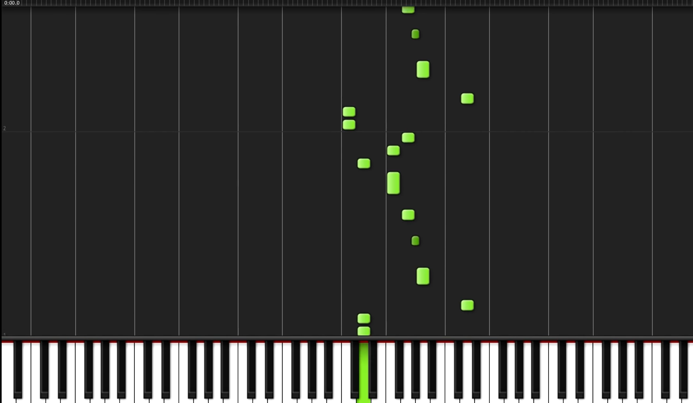
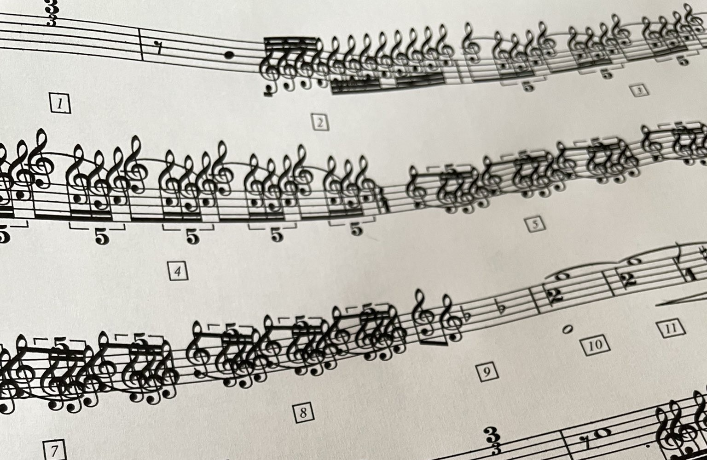
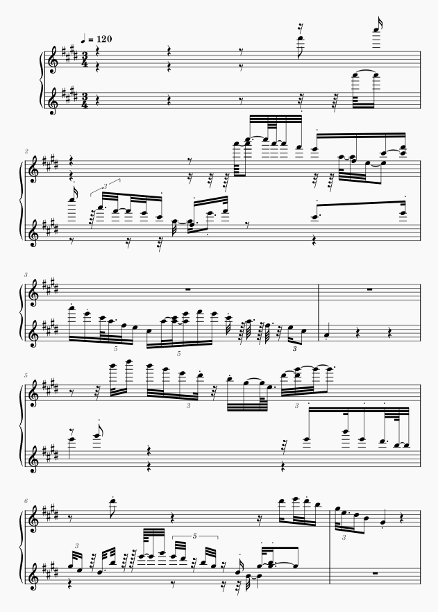
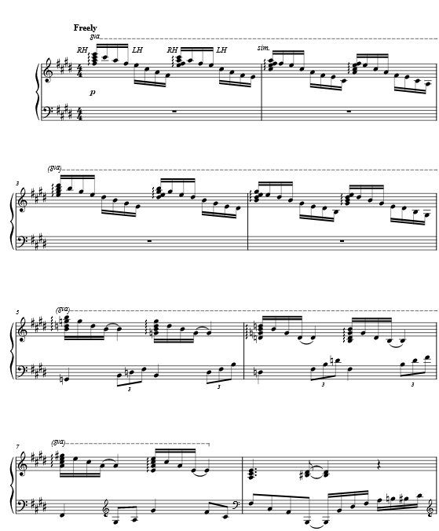

Video demonstrating me detecting all the notes being played in a Synthesia render:


[Source code](https://github.com/kevinlinxc/DeSynthesia)

## Background

**MIDI Files** (Musical Instrument Digital Interface) files are a standard way to represent music. They are a sequence of notes, each with a pitch, duration, and volume.

**Synthesia** is a program commonly used to render MIDI files to make these "tutorial" videos that you might have seen on YouTube:

**Sheet music** is another way of storing music, which is how almost all musicians read music. It looks like this:

## The Problem
There are many YouTube videos that are the Synthesia or Synthesia-styled videos. These show off how the song is played, but learning from them is not easy. The creators usually use these to sell the sheet music that they've also created.

While I would love to support these creators, the sheet music is usually 10 dollars for each sheet, which can add up to a lot of money over many songs. I realized that all of the information is theoretically already in the video, so I wanted to see if I could extract it using computer vision.

## Design
The engineering behind this project is not too complicated. Basically, on most Synthesia videos, the keys light up when they are being played. So, I simply use OpenCV, convert frames to HSV, and detect green/blue pixels.

From there, I use a Python MIDI library to generate my MIDI. One interesting thing to note is that I have to maintain some sort of state while I'm iterating through the frames. The MIDI file needs to know the duration of each note, so I have to keep track of when notes are first pressed and released. It's kind of like a LeetCode problem, but with actual real-life value.

After creating the MIDI file, I pass it on to a program called [MuseScore](https://musescore.org/en/download), which converts the MIDI file to sheet music.

## Results
The generated sheet music from my pipeline is...disappointing.

My MIDI translated to sheet music by MuseScore:

Actual sheet music:

This example is especially bad because I didn't remove the dead air at the start of the video, but you can still see that it is bad otherwise.

The biggest problem is that, despite having the right notes and the approximate correct durations, the technology for turning MIDI into high quality, readable sheet music isn't quite there yet. The generated sheet music is very messy, and the notes are not always aligned with the correct beats. When they are, they might not be placed in a way that humans would write them, which makes them hard to read. In the above example, the proper sheet music author uses the octave notation to make reading the sheet music easier, whereas the automatic conversion just puts the notes raw onto the staff.

I tried using a different program, [Sybelius](https://www.avid.com/sibelius), in place of MuseScore as it is supposedly better, but the results were still nothing close to human-made sheet music.

Although this is disappointing, to me, it represents an opportunity to improve the technology.

## The Knowledge Gap
All good scientists acknowledge areas where they or others could further investigate problems.
For this project, that gap is the translation from MIDI to sheet music.

We have so much sheet music that we can turn into MIDI files, and this means lots of data that a machine learning model could use to figure out the inverse relationship. I'm not quite sure how to quantify the placement of notes on the sheet music side, so I'd really have to dive into the literature to see what's out there.

I plan on eventually trying to fill this gap, but for now I'm going to focus on other projects and pay the $10 each time I really want sheet music.
