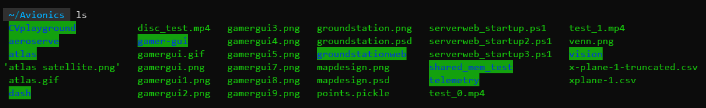
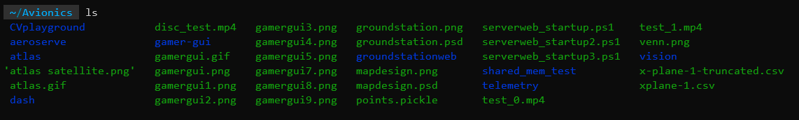

## WSL
WSL lets you run Linux on Windows without dual booting.

https://www.c-sharpcorner.com/article/how-to-install-windows-subsystem-for-linux-wsl2-on-windows-11/

After restarting my computer, WSL was available in the Windows Terminal


## Oh My Zsh
Zsh is a shell that is the default on Mac. Oh My Zsh is another layer on top that allows for lots of customizations and plugins.

Followed part of this guide to install Zsh and Oh My Zsh:
https://blog.joaograssi.com/windows-subsystem-for-linux-with-oh-my-zsh-conemu/#installing-zsh

Basically, just these lines:
```
sudo apt-get install git
sh -c "$(curl -fsSL https://raw.githubusercontent.com/robbyrussell/oh-my-zsh/master/tools/install.sh)"
```

## Powerlevel10k
Powerlevel10k is one of the most popular themes for Oh My Zsh. It has a really nice setup that asks you what your preferences are with visual help.

I followed the README here to set it up:
https://github.com/romkatv/powerlevel10k

## zsh-autosuggestions
This plugin uses your command history to suggest commands as you type. It's life-changing.

Install instructions are here:
https://github.com/zsh-users/zsh-autosuggestions/blob/master/INSTALL.md#oh-my-zsh

## Mounting Windows file system, kinda
I wanted to be able to access my Windows file system from WSL. The files are mounted in /mnt/ by default, so I made some symbolic links like so:

https://www.sitepoint.com/wsl2/#:~:text=with%20some%20applications.-,Accessing%20Windows%20Files%20from%20Linux,-Windows%20drives%20are

## Nicer `ls` colours
I didn't like the default `ls` colours so I added these two lines to my ~/.zshrc file:

https://gist.github.com/superbob/349776fdf5c8e082de4cd4b7c867835a#file-zshrc-L10-L11

```
export LS_COLORS="di=34;40:ln=36;40:so=35;40:pi=33;40:ex=32;40:bd=1;33;40:cd=1;33;40:su=0;41:sg=0;43:tw=0;42:ow=34;40:"
zstyle ':completion:*:default' list-colors ${(s.:.)LS_COLORS}
```
Before:


After:


I might try and improve this in the future as it's still not to my liking.
